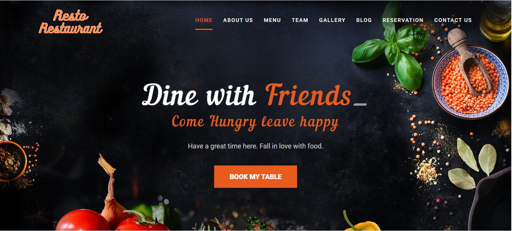

# Frontend_Backery-or-Restaurant_GSBSP-BR27
Frontend Hackathon for Restaurant Website

This website is made for the restaurant which shows all the features provided to customers. 
Customer can book the seat in advance or can dine in the restaurant with family, officemates, friends. 

Technology Stack used   
Html5 
Css3 
Bootstrap 
Javascript  

</img>

This website contains following features 
Home About US Team Gallery Reservation Contact US Blog  
